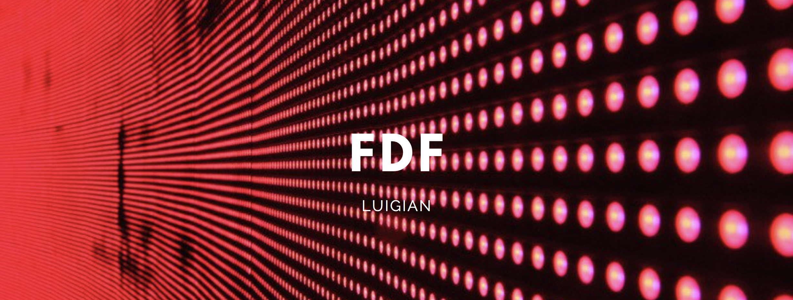
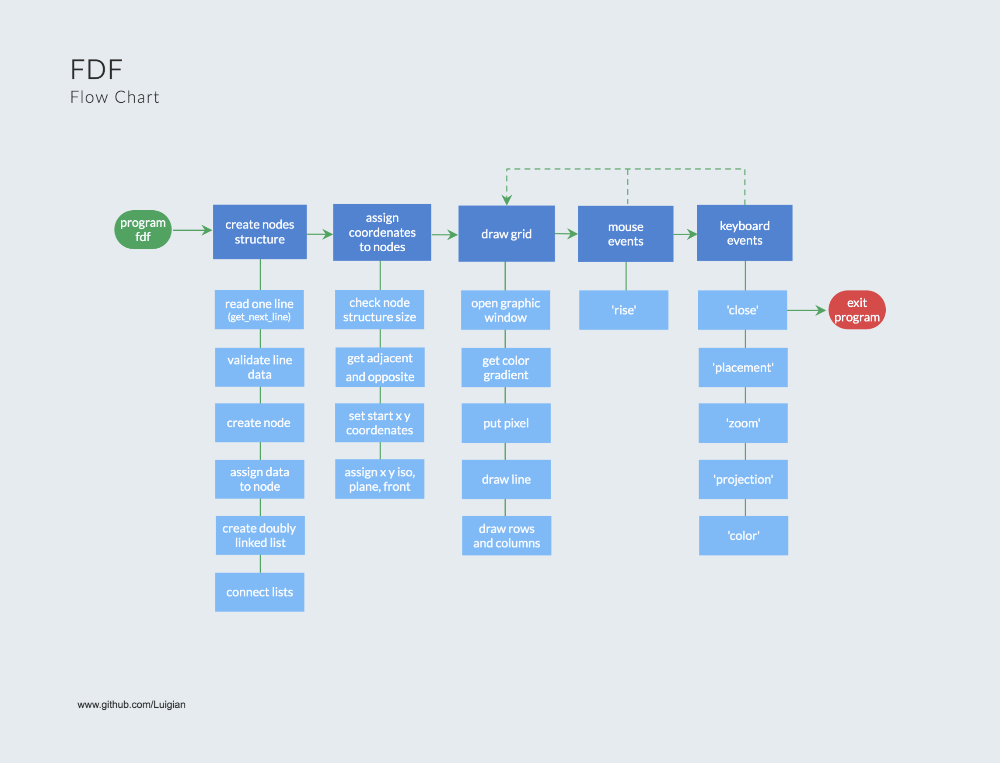
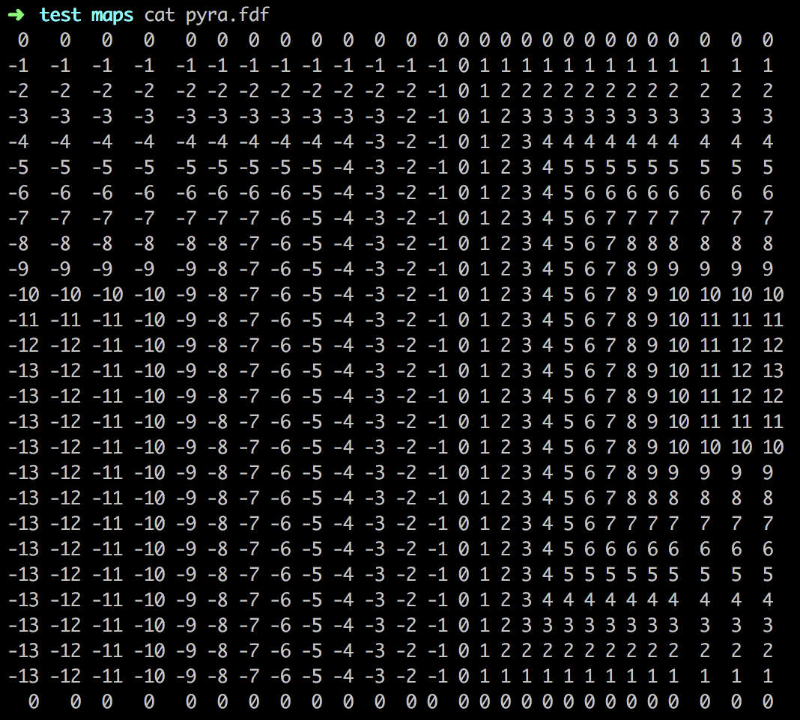
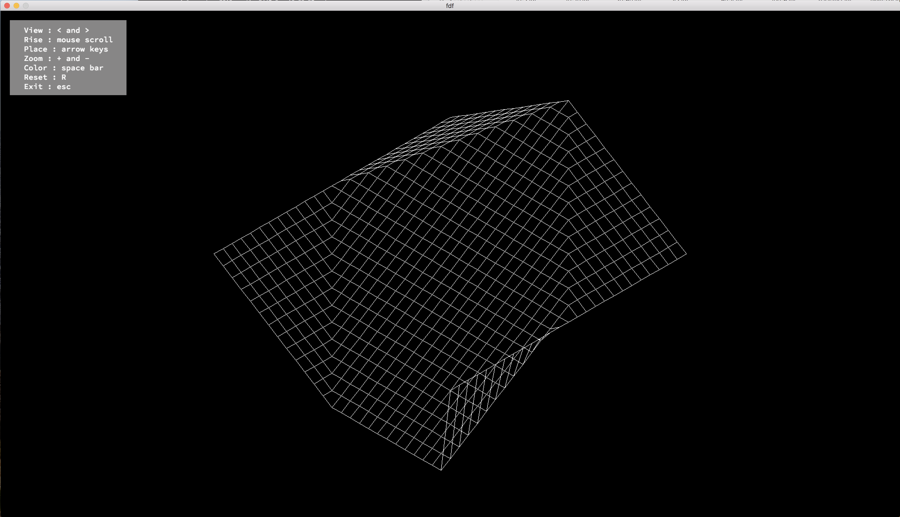

# FdF

This project was my first approach to the basics of graphic programming. Fdf project is about taking a text file as a parameter and retrieving data (characters) wich correspond to the x, y and z coordenates, and also the color, of many points that represent a map. I worked with the miniLibX graphic library and learned how to open a graphic window, how to calculate the place of the points and connect them with line segments to represent different perspectives (isometric, plane, front) of the same map. Dealing with these segments involved learning how to light a single pixel in the screen and use the Bresenham's algorithm. Observing the scene from a particular viewpoint made me learn about mouse and keyboard events and how these can make a program interact with the user.

One of the most interesting parts, in my opinion, is to deal with the calculation of gradients in the lines, which helped me to better understand the way in which the color is encoded and then manipulated.

## Flowchart:

## Input:

## Output:

## Key points:

* Trigonometry
* Objects
* Data structures.

## Objectives:
* Simple graphic library
* Segment layout
* Events
* 3D projection to 2D

## Skills:
* Graphics
* Imperative programming
* Algorithms & AI
* Rigor 

## Compilation:

`make all` | First time compilation.

`make fclean` | Delete files generated from compilation.

`make re` | Delete files generated from compilation and recompile.

## Execution:

`./fdf 'source_file'` | Initialize a map in the graphic interface.

## Author:

[*Luis Julian Sanchez Quiros*](https://www.linkedin.com/in/luis-juli%C3%A1n-s%C3%A1nchez-quir%C3%B3s-13bb3b189/)
2019. Freemont, CA
